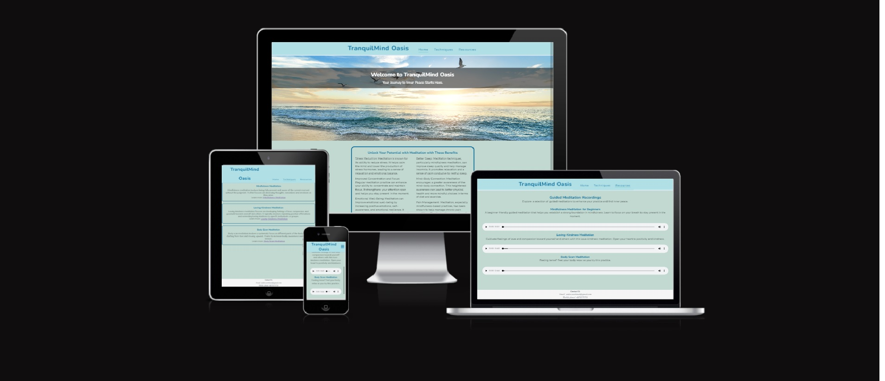
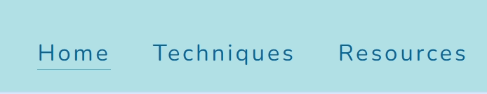
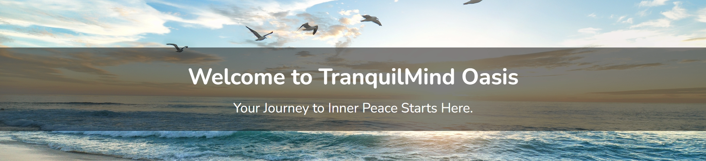
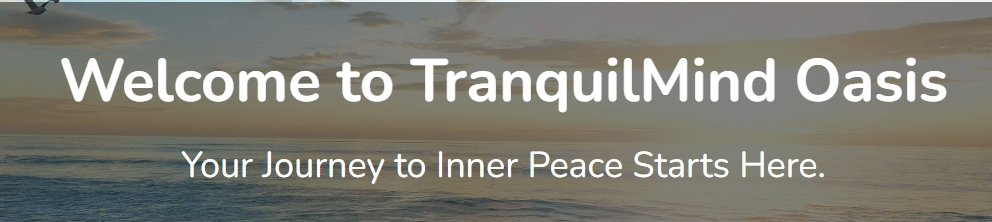
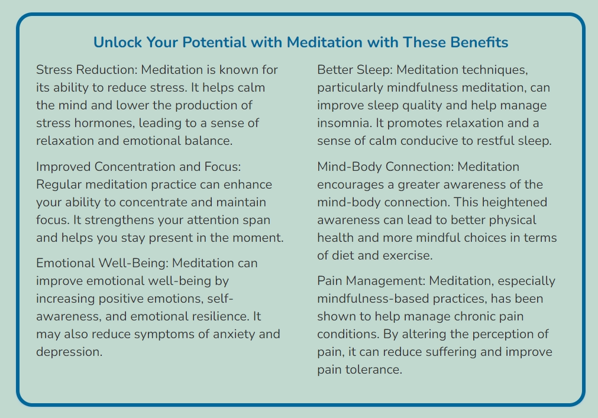

# TranquilMind Oasis Meditation Website

TranquilMind Oasis is a website dedicated to meditation.

The website includes benefits gained from meditation, some prevalent technique descriptions, and guided audio meditations.
<<<<<<< HEAD

## Purpose of the website

The website is targeted at individuals who are interested in meditation and mindfulness practices.

The primary purpose of the website is to provide meditation resources and information to help individuals on their mindfulness and meditation journey. It aims to create a serene online environment for users to explore and practice these techniques.

## Design

The website design is capped and optimized for different screen widths using media queries to ensure a responsive layout and user experience.

### Features

#### Navigation Menu

The website has a navigation menu in the header with links to different sections, including "Home," "Techniques," and "Resources."

#### Header

The header section contains the website's name, "TranquilMind Oasis," and a logo. It also features a navigation toggle button for mobile devices.

#### Responsive Design

The website is designed to be responsive, adapting its layout and content for various screen sizes and devices.

#### Hero Section

There is a hero section with a background image. It is intended to grab the user´s attention and set the tone for the website.

#### Welcome Message

The hero section includes a welcome message with a heading and a paragraph of text. The message is displayed over a semi-transparent background.

#### Benefits Section

The website has a "Benefits" section, which describes the benefits of meditation techniques. Columns are used to display the information.

#### Techniques Page

Link to [Techniques Page](https://flyhighhher.github.io/Meditation/techniques.html)

The website includes a "Techniques" page with various technique categories. Each category is presented with a title and description and associated link to the resource.

#### Guided Meditation Recordings

Link to [Resources page](https://flyhighhher.github.io/Meditation/resources.html)

The "Resources" page provides guided meditation recordings. Each recording is accompanied by a title, description, and an audio player.

#### Contact Information

In the footer section, there is contact information for the website. It includes an email address and a mobile phone number.

#### Styling

The website features a specific color scheme with a predominant use of the colors #006699, #b0e0e6, #C1D9D0, and #F5F5F5.

#### Typography

The website uses the "Nunito" and "Crimson Text" fonts from Google Fonts, indicating a specific typographical style.

#### Scrolling Behavior

The header is set to be fixed, so it remains visible as users scroll down the page.

#### Media Queries

The website uses media queries to adjust the layout and styling for different screen sizes, enhancing the user experience on tablets and larger devices.

#### Audio Elements

The website features audio elements with controls for users to play guided meditation recordings.

## Testing

The website was tested using Google Chrome and Opera GX after deployment to GitHub.

### Validator testing

All web files (HTML) have been tested using [W3C Markup Validation Service](https://validator.w3.org/). All files have passed the test and no errors were found.

The style.css file (CSS) has been tested using [W3C CSS Validation Service](https://jigsaw.w3.org/css-validator/). The file has passed the test and errors were found.

### The Lighthouse Report

The lighthouse report was created for desktops and mobiles for pages home, techniques, and resources.

#### The Lighthouse Report about home for desktop

![lighthouse report about home for desktop devices]

#### The Lighthouse Report about home for mobile

![lighthouse report about home for mobile devices]

#### The Lighthouse Report about techniques for desktop

![lighthouse report about techniques for desktop devices]

#### The Lighthouse Report about techniques for mobile

![lighthouse report about techniques for mobile devices]

#### The Lighthouse Report about resources for desktop

![lighthouse report about resources for desktop devices]

#### The Lighthouse Report about resources for mobile

![lighthouse report for resources for mobile devices]

### Unfixed bugs

The website has been tested and all known bugs have been fixed.

## Deployment

The website was deployed to GitHub using the steps below

- from the GitHub account home page, navigate to the Meditation repository
- on the top navigation bar click on Settings
- on the left side menu click on Pages
- from the source section drop-down menu, select the Main Branch

After the Main Branch has been selected, the site will be deployed after a few minutes.

The website is now deployed and is at [flyhighhher.github.io/Meditation/] (<https://flyhighhher.github.io/Meditation/>)

## Credits

### Content

The inspiration for the website was taken from the [Love Running](https://github.com/Code-Institute-Solutions/readme-template) site. While also the video walkthroughs were also very helpful in creating the initial code.

Helpful site for understanding how to use elements (<https://www.w3schools.com/>)
Another helpful site was (<https://developer.mozilla.org/en-US/>).
=======

## Purpose of the website

The website is targeted at individuals who are interested in meditation and mindfulness practices.

The primary purpose of the website is to provide meditation resources and information to help individuals on their mindfulness and meditation journey. It aims to create a serene online environment for users to explore and practice these techniques.

## Design

The website design is capped and optimized for different screen widths using media queries to ensure a responsive layout and user experience.

### Features

#### Navigation Menu

The website has a navigation menu in the header with links to different sections, including "Home," "Techniques," and "Resources."

#### Header

The header section contains the website's name, "TranquilMind Oasis," and a logo. It also features a navigation toggle button for mobile devices.

#### Responsive Design

The website is designed to be responsive, adapting its layout and content for various screen sizes and devices.

#### Hero Section

There is a hero section with a background image. It is intended to grab the user´s attention and set the tone for the website.

#### Welcome Message

The hero section includes a welcome message with a heading and a paragraph of text. The message is displayed over a semi-transparent background.

#### Benefits Section

The website has a "Benefits" section, which describes the benefits of meditation techniques. Columns are used to display the information.

#### Techniques Page

Link to [Techniques Page](https://flyhighhher.github.io/Meditation/techniques.html)

The website includes a "Techniques" page with various technique categories. Each category is presented with a title and description and associated link to the resource.

#### Guided Meditation Recordings

Link to [Resources page](https://flyhighhher.github.io/Meditation/resources.html)

The "Resources" page provides guided meditation recordings. Each recording is accompanied by a title, description, and an audio player.

#### Contact Information

In the footer section, there is contact information for the website. It includes an email address and a mobile phone number.

#### Styling

The website features a specific color scheme with a predominant use of the colors #006699, #b0e0e6, #C1D9D0, and #F5F5F5.

#### Typography

The website uses the "Nunito" and "Crimson Text" fonts from Google Fonts, indicating a specific typographical style.

#### Scrolling Behavior

The header is set to be fixed, so it remains visible as users scroll down the page.

#### Media Queries

The website uses media queries to adjust the layout and styling for different screen sizes, enhancing the user experience on tablets and larger devices.

#### Audio Elements

The website features audio elements with controls for users to play guided meditation recordings.

## Testing

The website was tested using Google Chrome and Opera GX after deployment to GitHub.

### Validator testing

All web files (HTML) have been tested using [W3C Markup Validation Service](https://validator.w3.org/). All files have passed the test and no errors were found.

The style.css file (CSS) has been tested using [W3C CSS Validation Service](https://jigsaw.w3.org/css-validator/). The file has passed the test and errors were found.

### The Lighthouse Report

The lighthouse report was created for desktops and mobiles for pages home, techniques, and resources.

#### The Lighthouse Report about home for desktop

![lighthouse report about home for desktop devices]

#### The Lighthouse Report about home for mobile

![lighthouse report about home for mobile devices]

#### The Lighthouse Report about techniques for desktop

![lighthouse report about techniques for desktop devices]

#### The Lighthouse Report about techniques for mobile

![lighthouse report about techniques for mobile devices]

#### The Lighthouse Report about resources for desktop

![lighthouse report about resources for desktop devices]

#### The Lighthouse Report about resources for mobile

![lighthouse report for resources for mobile devices]

### Unfixed bugs

The website has been tested and all known bugs have been fixed.

## Deployment

The website was deployed to GitHub using the steps below

- from the GitHub account home page, navigate to the Meditation repository
- on the top navigation bar click on Settings
- on the left side menu click on Pages
- from the source section drop-down menu, select the Main Branch

After the Main Branch has been selected, the site will be deployed after a few minutes.

The website is now deployed and is at [flyhighhher.github.io/Meditation/] (<https://flyhighhher.github.io/Meditation/>)

## Credits

### Content

The inspiration for the website was taken from the [Love Running](https://github.com/Code-Institute-Solutions/readme-template) site. While also the video walkthroughs were also very helpful in creating the initial code.

A helpful site to get definitions and understandings of elements was (<https://www.w3schools.com/html/default.asp>).
Another helpful site was (<https://developer.mozilla.org/en-US/>).

### Media

There were 3 audio files used for meditations - taken from [Greater Good Science Center](https://ggsc.berkeley.edu/)
There is 1 image used for the hero image by Frank McKenna - taken from [Unsplash](https://unsplash.com/)
There is 1 icon used for the navigation bar in the header - taken from [Font Awesome](https://fontawesome.com/).
The two fonts used in the website, Nunito and Crimson, were taken from [Google Fonts](https://fonts.google.com/).

>>>>>>> 2a9a1a9398b9dc485cf6915c927a02f500cb61f6
